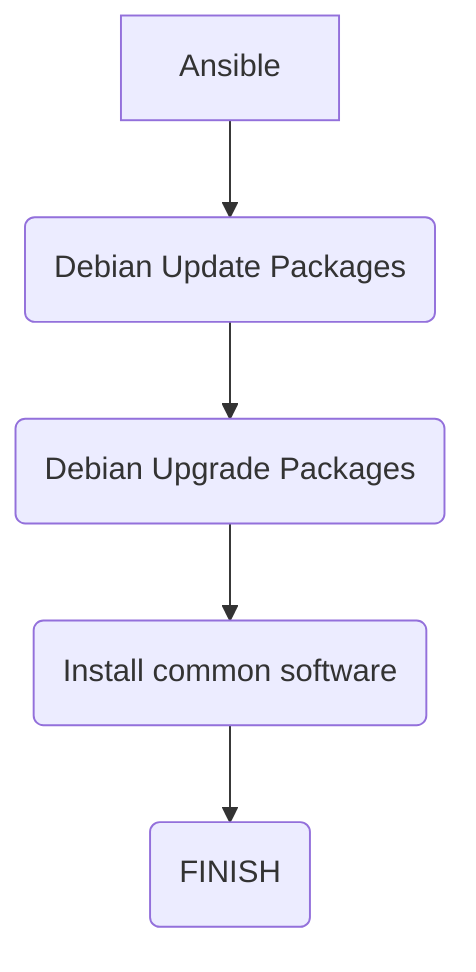

# Ansible-DebianUpdate

This is Ansible Automation to Update Debian Installed Software

# Diagram

# Requirement
- Debian Operating System
- Debian Repository

# common software
        - build-essential
        - curl
        - libssl-dev
        - wget
        - nano

# how to install

# Thanks
contributor : t3mp30r3k@2022 (kangoprek.com) - rusdianto
